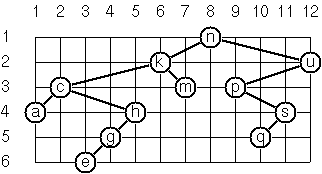
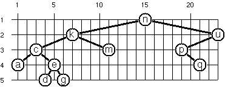
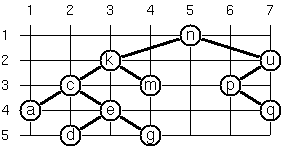

 **Solutions can be found
[here](http://sites.google.com/site/prologsite/prolog-problems/4/solutions-4).**

**A binary tree is either empty or it is composed of a root element and
two successors, which are binary trees themselves.**

In Prolog we represent the empty tree by the atom 'nil' and the
non-empty tree by the term t(X,L,R), where X denotes the root node and L
and R denote the left and right subtree, respectively. The example tree
depicted opposite is therefore represented by the following Prolog
term:

T1 =
t(a,t(b,t(d,nil,nil),t(e,nil,nil)),t(c,nil,t(f,t(g,nil,nil),nil)))

Other examples are a binary tree that consists of a root node only:

T2 = t(a,nil,nil) or an empty binary tree: T3 = nil

**4.01 (\*) Check whether a given term represents a binary tree**

Write a predicate istree/1 which succeeds if and only if its argument is
a Prolog term representing a binary tree.  
Example:  
?- istree(t(a,t(b,nil,nil),nil)).  
Yes  
?- istree(t(a,t(b,nil,nil))).  
No

**4.02 (\*\*) Construct completely balanced binary trees**

In a completely balanced binary tree, the following property holds for
every node: The number of nodes in its left subtree and the number of
nodes in its right subtree are almost equal, which means their
difference is not greater than one.

Write a predicate cbal_tree/2 to construct completely balanced binary
trees for a given number of nodes. The predicate should generate all
solutions via backtracking. Put the letter 'x' as information into all
nodes of the tree.  
Example:  
?- cbal_tree(4,T).  
T = t(x, t(x, nil, nil), t(x, nil, t(x, nil, nil))) ;  
T = t(x, t(x, nil, nil), t(x, t(x, nil, nil), nil)) ;  
etc......No

**4.03 (\*\*) Symmetric binary trees**

Let us call a binary tree symmetric if you can draw a vertical line
through the root node and then the right subtree is the mirror image of
the left subtree. Write a predicate symmetric/1 to check whether a given
binary tree is symmetric. **Hint:** Write a predicate mirror/2 first to
check whether one tree is the mirror image of another. We are only
interested in the structure, not in the contents of the nodes.

**4.04 (\*\*) Binary search trees (dictionaries)**

Use the predicate add/3, developed in chapter 4 of the course, to write
a predicate to construct a binary search tree from a list of integer
numbers.  
Example:  
?- construct(\[3,2,5,7,1\],T).  
T = t(3, t(2, t(1, nil, nil), nil), t(5, nil, t(7, nil, nil)))

Then use this predicate to test the solution of the problem P56.  
Example:  
?- test_symmetric(\[5,3,18,1,4,12,21\]).  
Yes  
?- test_symmetric(\[3,2,5,7,4\]).  
No

**4.05 (\*\*) Generate-and-test paradigm**

Apply the generate-and-test paradigm to construct all symmetric,
completely balanced binary trees with a given number of nodes.
Example:  
?- sym_cbal_trees(5,Ts).  
Ts = \[t(x, t(x, nil, t(x, nil, nil)), t(x, t(x, nil, nil), nil)), t(x,
t(x, t(x, nil, nil), nil), t(x, nil, t(x, nil, nil)))\]

How many such trees are there with 57 nodes? Investigate about how many
solutions there are for a given number of nodes? What if the number is
even? Write an appropriate predicate.

**4.06 (\*\*) Construct height-balanced binary trees**

In a height-balanced binary tree, the following property holds for every
node: The height of its left subtree and the height of its right subtree
are almost equal, which means their difference is not greater than
one.

Write a predicate hbal_tree/2 to construct height-balanced binary trees
for a given height. The predicate should generate all solutions via
backtracking. Put the letter 'x' as information into all nodes of the
tree.  
Example:  
?- hbal_tree(3,T).  
T = t(x, t(x, t(x, nil, nil), t(x, nil, nil)), t(x, t(x, nil, nil), t(x,
nil, nil))) ;  
T = t(x, t(x, t(x, nil, nil), t(x, nil, nil)), t(x, t(x, nil, nil),
nil)) ;  
etc......No

**4.07 (\*\*) Construct height-balanced binary trees with a given number of nodes**

Consider a height-balanced binary tree of height H. What is the maximum
number of nodes it can contain?

Clearly, MaxN = 2\*\*H - 1. However, what is the minimum number MinN?
This question is more difficult. Try to find a recursive statement and
turn it into a predicate minNodes/2 defined as follwos:

% minNodes(H,N) :- N is the minimum number of nodes in a height-balanced
binary tree of height H.  
(integer,integer), (+,?)

On the other hand, we might ask: what is the maximum height H a
height-balanced binary tree with N nodes can have?

% maxHeight(N,H) :- H is the maximum height of a height-balanced binary
tree with N nodes  
(integer,integer), (+,?)

Now, we can attack the main problem: construct all the height-balanced
binary trees with a given nuber of nodes.

% hbal_tree_nodes(N,T) :- T is a height-balanced binary tree with N
nodes.

Find out how many height-balanced trees exist for N = 15.

**4.08 (\*) Count the leaves of a binary tree**

A leaf is a node with no successors. Write a predicate count_leaves/2 to
count them.

% count_leaves(T,N) :- the binary tree T has N leaves

**4.09 (\*) Collect the leaves of a binary tree in a list**

A leaf is a node with no successors. Write a predicate leaves/2 to
collect them in a list.

% leaves(T,S) :- S is the list of all leaves of the binary tree T

**4.10 (\*) Collect the internal nodes of a binary tree in a list**

An internal node of a binary tree has either one or two non-empty
successors. Write a predicate internals/2 to collect them in a list.

% internals(T,S) :- S is the list of internal nodes of the binary tree
T.

**4.11 (\*) Collect the nodes at a given level in a list**

A node of a binary tree is at level N if the path from the root to the
node has length N-1. The root node is at level 1. Write a predicate
atlevel/3 to collect all nodes at a given level in a list.

% atlevel(T,L,S) :- S is the list of nodes of the binary tree T at level
L

Using atlevel/3 it is easy to construct a predicate levelorder/2 which
creates the level-order sequence of the nodes. However, there are more
efficient ways to do that.

**4.12 (\*\*) Construct a complete binary tree**

A *complete* binary tree with height H is defined as follows: The levels
1,2,3,...,H-1 contain the maximum number of nodes (i.e 2\*\*(i-1) at the
level i, note that we start counting the levels from 1 at the root). In
level H, which may contain less than the maximum possible number of
nodes, all the nodes are "left-adjusted". This means that in a
levelorder tree traversal all internal nodes come first, the leaves come
second, and empty successors (the nil's which are not really nodes!)
come last.

Particularly, complete binary trees are used as data structures (or
addressing schemes) for heaps.

We can assign an address number to each node in a complete binary tree
by enumerating the nodes in levelorder, starting at the root with
number 1. In doing so, we realize that for every node X with address A
the following property holds: The address of X's left and right
successors are 2\*A and 2\*A+1, respectively, supposed the successors do
exist. This fact can be used to elegantly construct a complete binary
tree structure. Write a predicate complete_binary_tree/2 with the
following specification:

% complete_binary_tree(N,T) :- T is a complete binary tree with N nodes.
(+,?)

Test your predicate in an appropriate way.

**4.13 (\*\*) Layout a binary tree (1)**

Given a binary tree as the usual Prolog term t(X,L,R) (or nil). As a
preparation for drawing the tree, a layout algorithm is required to
determine the position of each node in a rectangular grid. Several
layout methods are conceivable, one of them is shown in the illustration
below.

In this layout strategy, the position of a node *v* is obtained by the
following two rules:

- *x(v)* is equal to the position of the node *v* in the **inorder**
- *y(v)* is equal to the depth of the node *v* in the tree sequence

In order to store the position of the nodes, we extend the Prolog term
representing a node (and its successors) as follows: 

% nil represents the empty tree (as usual)  
% t(W,X,Y,L,R) represents a (non-empty) binary tree with root W
"positioned" at (X,Y), and subtrees L and R  
Write a predicate layout_binary_tree/2 with the following
specification:

% layout_binary_tree(T,PT) :- PT is the "positioned" binary tree
obtained from the binary tree T. (+,?)

Test your predicate in an appropriate way.

**4.14 (\*\*) Layout a binary tree (2)**

An alternative layout method is depicted in the above illustration. Find
out the rules and write the corresponding Prolog predicate. Hint: On a
given level, the horizontal distance between neighboring nodes is
constant.

Use the same conventions as in problem 4.13 and test your predicate in
an appropriate way.

**4.15 (\*\*\*) Layout a binary tree (3)**

Yet another layout strategy is shown in the above illustration. The
method yields a very compact layout while maintaining a certain symmetry
in every node. Find out the rules and write the corresponding Prolog
predicate. Hint: Consider the horizontal distance between a node and its
successor nodes. How tight can you pack together two subtrees to
construct the combined binary tree?

Use the same conventions as in problem 4.13 and 4.14 and test your
predicate in an appropriate way. Note: This is a difficult problem.
Don't give up too early!

Which layout do you like most?

**4.16 (\*\*) A string representation of binary trees**

Somebody represents binary trees as strings of the following type (see
example):

a(b(d,e),c(,f(g,)))

**a** Write a Prolog predicate which generates this string
representation, if the tree is given as usual (as nil or t(X,L,R) term).
Then write a predicate which does this inverse; i.e. given the string
representation, construct the tree in the usual form. Finally, combine
the two predicates in a single predicate tree_string/2 which can be used
in both directions.

**b)** Write the same predicate tree_string/2 using difference lists and
a single predicate tree_dlist/2 which does the conversion between a tree
and a difference list in both directions.

For simplicity, suppose the information in the nodes is a single letter
and there are no spaces in the string.

**4.17 (\*\*) Preorder and inorder sequences of binary trees**

We consider binary trees with nodes that are identified by single
lower-case letters, as in the example of problem 4.16.

**a)** Write predicates preorder/2 and inorder/2 that construct the
preorder and inorder sequence of a given binary tree, respectively. The
results should be atoms, e.g. 'abdecfg' for the preorder sequence of the
example in problem 4.16.

**b)** Can you use preorder/2 from problem part a) in the reverse
direction; i.e. given a preorder sequence, construct a corresponding
tree? If not, make the necessary arrangements.

**c)** If both the preorder sequence and the inorder sequence of the
nodes of a binary tree are given, then the tree is determined
unambiguously. Write a predicate pre_in_tree/3 that does the job.

**d)** Solve problems a) to c) using difference lists. Cool! Use the
predefined predicate time/1 to compare the solutions.

What happens if the same character appears in more than one node. Try
for instance pre_in_tree(aba,baa,T).

**4.18 (\*\*) Dotstring representation of binary trees**

We consider again binary trees with nodes that are identified by single
lower-case letters, as in the example of problem 4.16. Such a tree can
be represented by the preorder sequence of its nodes in which dots (.)
are inserted where an empty subtree (nil) is encountered during the tree
traversal. For example, the tree shown in problem 4.16 is represented as
'abd..e..c.fg...'. First, try to establish a syntax (BNF or syntax
diagrams) and then write a predicate tree_dotstring/2 which does the
conversion in both directions. Use difference lists.

Subpages

(1):

<a href="/site/prologsite/prolog-problems/4/solutions-4"
dir="ltr">Solutions-4</a>
