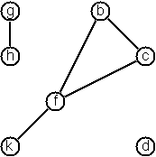
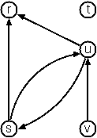
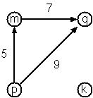
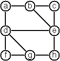

 **Solutions can be found
[here](https://sites.google.com/site/prologsite/prolog-problems/6/solutions-6).**

**A preliminary remark: The vocabulary in graph theory varies
considerably. Some authors use the same word with different meanings.
Some authors use different words to mean the same thing. I hope that our
definitions are free of contradictions.**

**A graph is defined as a set of *nodes* and a set of *edges*, where each
edge is a pair of nodes.**

There are several ways to represent graphs in Prolog.

One method is to represent each edge separately as one clause (fact). In
this form, the graph depicted opposite is represented as the following
predicate:

    edge(h,g).
    edge(k,f).
    edge(f,b).
    ...

We call this ***edge-clause form***.

Obviously, isolated nodes cannot be represented. Another method is to
represent the whole graph as one data object. According to the
definition of the graph as a pair of two sets (nodes and edges), we may
use the following Prolog term to represent the above example graph:

    graph([b,c,d,f,g,h,k],[e(b,c),e(b,f),e(c,f),e(f,k),e(g,h)])

We call this ***graph-term form***. Note, that the lists are kept
sorted, they are really *sets*, without duplicated elements. Each edge
appears only once in the edge list; i.e. an edge from a node x to
another node y is represented as e(x,y), the term e(y,x) is not present.
**The graph-term form is our default representation.** In SWI-Prolog
there are predefined predicates to work with sets.

A third representation method is to associate with each node the set of
nodes that are adjacent to that node. We call this the ***adjacency-list
form***. In our example:

    [n(b,[c,f]), n(c,[b,f]), n(d,[]), n(f,[b,c,k]), ...]

The representations we introduced so far are Prolog terms and therefore
well suited for automated processing, but their syntax is not very
user-friendly. Typing the terms by hand is cumbersome and error-prone.
We can define a more compact and "human-friendly" notation as follows: A
graph is represented by a list of atoms and terms of the type X-Y (i.e.
functor '-' and arity 2). The atoms stand for isolated nodes, the X-Y
terms describe edges. If an X appears as an endpoint of an edge, it is
automatically defined as a node. Our example could be written as:

    [b-c, f-c, g-h, d, f-b, k-f, h-g]

We call this the ***human-friendly form***. As the example shows, the
list does not have to be sorted and may even contain the same edge
multiple times. Notice the isolated node d. (Actually, isolated nodes do
not even have to be atoms in the Prolog sense, they can be compound
terms, as in d(3.75,blue) instead of d in the example).

When the edges are *directed* we call them *arcs*. These are represented
by *ordered* pairs. Such a graph is called **directed graph** (or
digraph, for short). To represent a directed graph, the forms discussed
above are slightly modified. The example graph opposite is represented
as follows:

*Arc-clause form*  
arc(s,u).  
arc(u,r).  
...

*Graph-term form*  
digraph(\[r,s,t,u,v\],\[a(s,r),a(s,u),a(u,r),a(u,s),a(v,u)\])

*Adjacency-list form*  
\[n(r,\[\]),n(s,\[r,u\]),n(t,\[\]),n(u,\[r\]),n(v,\[u\])\]  
Note that the adjacency-list does not have the information on whether it
is a graph or a digraph.

*Human-friendly form*  
\[s \> r, t, u \> r, s \> u, u \> s, v \> u\]

Finally, graphs and digraphs may have additional information attached to
nodes and edges (arcs). For the nodes, this is no problem, as we can
easily replace the single character identifiers with arbitrary compound
terms, such as city('London',4711). On the other hand, for edges we have
to extend our notation. Graphs with additional information attached to
edges are called **labeled graphs**.

*Arc-clause form*  
arc(m,q,7).  
arc(p,q,9).  
arc(p,m,5).

*Graph-term form*  
digraph(\[k,m,p,q\],\[a(m,p,7),a(p,m,5),a(p,q,9)\])

*Adjacency-list form*  
\[n(k,\[\]),n(m,\[q/7\]),n(p,\[m/5,q/9\]),n(q,\[\])\]  
Notice how the edge information has been packed into a term with functor
'/' and arity 2, together with the corresponding node.

*Human-friendly form*  
\[p\>q/9, m\>q/7, k, p\>m/5\]

The notation for labeled graphs can also be used for so-called
**multi-graphs**, where more than one edge (or arc) are allowed between
two given nodes.  

**6.01 (\*\*\*) Conversions**

Write predicates to convert between the different graph representations.
With these predicates, all representations are equivalent; i.e. for the
following problems you can always freely pick the most convenient form.
The reason this problem is rated (\*\*\*) is not because it's
particularly difficult, but because it's a lot of work to deal with all
the special cases.

**6.02 (\*\*) Path from one node to another one**

Write a predicate path(G,A,B,P) to find an acyclic path P from node A to
node B in the graph G. The predicate should return all paths via
backtracking.

**6.03 (\*) Cycle from a given node**

Write a predicate cycle(G,A,P) to find a closed path (cycle) P starting
at a given node A in the graph G. The predicate should return all cycles
via backtracking.

**6.04 (\*\*) Construct all spanning trees**

Write a predicate s_tree(Graph,Tree) to construct (by backtracking) all
spanning trees of a given graph. With this predicate, find out how many
spanning trees there are for the graph depicted to the left. The data of
this example graph can be found in the file p6_04.dat. When you have a
correct solution for the s_tree/2 predicate, use it to define two other
useful predicates: is_tree(Graph) and is_connected(Graph). Both are
five-minutes tasks!

**6.05 (\*\*) Construct the minimal spanning tree**

Write a predicate ms_tree(Graph,Tree,Sum) to construct the minimal
spanning tree of a given labelled graph. Hint: Use the algorithm of
Prim. A small modification of the solution of 6.04 does the trick. The
data of the example graph to the right can be found in the file
p6_05.dat.

**6.06 (\*\*) Graph isomorphism**

Two graphs G1(N1,E1) and G2(N2,E2) are isomorphic if there is a
bijection f: N1 -\> N2 such that for any nodes X,Y of N1, X and Y are
adjacent if and only if f(X) and f(Y) are adjacent.

Write a predicate that determines whether two graphs are isomorphic.
Hint: Use an open-ended list to represent the function f.

**6.07 (\*\*) Node degree and graph coloration**

**a)** Write a predicate degree(Graph,Node,Deg) that determines the
degree of a given node.

**b)** Write a predicate that generates a list of all nodes of a graph
sorted according to decreasing degree.

**c)** Use Welch-Powell's algorithm to paint the nodes of a graph in
such a way that adjacent nodes have different colors.

**6.08 (\*\*) Depth-first order graph traversal**

Write a predicate that generates a depth-first order graph traversal
sequence. The starting point should be specified, and the output should
be a list of nodes that are reachable from this starting point (in
depth-first order).

**6.09 (\*\*) Connected components**

Write a predicate that splits a graph into its connected components.

**6.10 (\*\*) Bipartite graphs**

Write a predicate that finds out whether a given graph is bipartite.

**6.11 (\*\*\*) Generate K-regular simple graphs with N nodes**

In a K-regular graph all nodes have a degree of K; i.e. the number of
edges incident in each node is K. How many (non-isomorphic!) 3-regular
graphs with 6 nodes are there?

See also the table of results in p6_11.txt.

Subpages

(1):

<a href="/site/prologsite/prolog-problems/6/solutions-6"
dir="ltr">Solutions-6</a>
